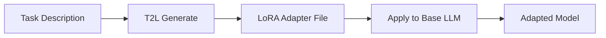

# Text-to-LoRA (T2L)

> **Instant LLM Adaptation through Natural Language Task Descriptions**

T2L (Text-to-LoRA) is a production-ready **pure Rust** implementation of the groundbreaking approach from ["Text-to-LoRA: Producing Low-Rank Adaptation Weights from Natural Language"](https://arxiv.org/pdf/2506.06105). It enables instant adaptation of large language models through natural language task descriptions, eliminating the need for traditional fine-tuning.

## 🌟 Features

- **🚀 Instant Adaptation**: Generate task-specific LoRA adapters from natural language descriptions in seconds
- **🦀 Pure Rust**: Native performance with memory safety
- **🏗️ Multiple Architectures**: Support for LLaMA, Mistral, Gemma, Phi, and Qwen models
- **⚡ Hardware Acceleration**: CUDA and SIMD optimizations for maximum throughput
- **🔧 Flexible Training**: Support for both reconstruction (distilling pre-trained LoRAs) and supervised fine-tuning
- **📊 Comprehensive Evaluation**: Built-in zero-shot evaluation on standard benchmarks (GSM8K, Arc, BoolQ, etc.)
- **🔌 Easy Integration**: Simple CLI and library API for seamless workflow integration
- **📈 Production Ready**: Async processing, batch operations, and robust error handling

## 📦 Installation

### Prerequisites

- **Rust 1.70+** (install via [rustup](https://rustup.rs/))
- **CUDA 11.8+** (optional, for GPU acceleration)
- **Base LLM** (LLaMA, Mistral, etc.) via Candle, Transformers, or llama.cpp

### Quick Integration Example

```bash
# 1. Generate a task-specific LoRA adapter
t2l generate --task "Translate English to Spanish" --output translator.safetensors

# 2. Apply to your LLM
# Option A: Direct inference
t2l infer --base-model llama-7b --adapter translator.safetensors --prompt "Hello world"

# Option B: Export for external tools
t2l export --adapter translator.safetensors --format peft --output ./translator_peft/
# Use with your preferred inference framework
```

### From Source

```bash
git clone https://github.com/yourusername/lorax.git
cd lorax
cargo build --release

# Install CLI globally
cargo install --path t2l-core
```

### As a Library

Add to your `Cargo.toml`:

```toml
[dependencies]
lorax = { git = "https://github.com/yourusername/lorax.git" }
```

## 🚀 Quick Start

### Complete Workflow Overview

T2L works in **two steps**:
1. **Generate** LoRA adapters from task descriptions (using T2L)
2. **Apply** adapters to your base LLM (using existing ML frameworks)



### Step 1: Generate LoRA Adapter

```rust
use lorax::{TextToLora, Config};

#[tokio::main]
async fn main() -> Result<(), Box<dyn std::error::Error>> {
    // Initialize T2L system
    let config = Config::default();
    let t2l = TextToLora::new(config).await?;

    // Generate LoRA adapter from task description
    let lora_params = t2l.generate(
        "Translate English text to French while maintaining formal tone"
    ).await?;

    // Save adapter to file
    lora_params.save("french_adapter.safetensors")?;
    println!("✅ Generated LoRA adapter with {} parameters", 
             lora_params.total_parameters());
    
    Ok(())
}
```

### Step 2: Apply to Your LLM

**Option A: Using Candle (Rust)**
```rust
use candle_transformers::models::llama::LlamaModel;
use lorax::LoraParameters;

// Load your base LLM
let mut base_model = LlamaModel::load("path/to/llama-7b")?;

// Load T2L-generated adapter
let lora_params = LoraParameters::load("french_adapter.safetensors")?;

// Apply adapter to model
base_model.apply_lora(&lora_params)?;

// Use adapted model
let response = base_model.generate("Hello, how are you?")?;
// Expected: "Bonjour, comment allez-vous ?"
```

**Option B: Export for External Frameworks**
```bash
# Export to PEFT format for use with HuggingFace Transformers
t2l export --adapter french_adapter.safetensors \
           --format peft \
           --output ./french_adapter_peft/

# Export to GGML format for use with llama.cpp
t2l export --adapter french_adapter.safetensors \
           --format ggml \
           --output french_adapter.ggml
```

### Command Line Interface

```bash
# Generate LoRA adapter from task description
t2l generate --task "Solve mathematical word problems step by step" \
             --output math_adapter.safetensors \
             --architecture llama \
             --variant M

# Batch generation from file
t2l generate --batch-file tasks.txt --workers 4

# Train T2L hypernetwork (reconstruction mode)
t2l train --mode reconstruction \
          --dataset path/to/lora_dataset \
          --output ./trained_model \
          --epochs 10

# Supervised fine-tuning with downstream tasks
t2l train --mode supervised \
          --base-model llama2-7b \
          --tasks sentiment,qa,summarization \
          --config configs/supervised_config.toml

# Multi-task learning
t2l train --mode multi-task \
          --config examples/training/configs/multi_task_config.toml \
          --distributed

# Evaluate on benchmarks
t2l evaluate --model ./trained_model \
             --benchmarks gsm8k,arc,boolq \
             --output results.json

# Start API server
t2l serve --model ./trained_model --port 8080
```

## 🔗 Integration with Existing LLMs

### Supported Base Models

T2L generates adapters compatible with these architectures:

| Architecture | Models | Status | Key Features |
|-------------|--------|---------|--------------|
| **LLaMA** | LLaMA-2-7B/13B/70B, Code Llama | ✅ Full Support | RMSNorm, SwiGLU, RoPE |
| **Mistral** | Mistral-7B, Mixtral 8x7B | ✅ Full Support | Sliding Window Attention, GQA |
| **Gemma** | Gemma-2B/7B | ✅ Full Support | Multi-Query Attention |
| **Phi** | Phi-1.5/2/3 | ⚠️ Experimental | Dense architecture |
| **Qwen** | Qwen-7B/14B | ⚠️ Experimental | Custom tokenizer support |

### Export Formats & Conversion

T2L supports exporting to multiple formats for seamless integration:

#### PEFT Format (Recommended for Python)
```bash
# Export with automatic configuration detection
t2l export --adapter translator.safetensors \
           --format peft \
           --target-model meta-llama/Llama-2-7b-hf \
           --output ./translator_peft/

# Export with custom precision
t2l export --adapter translator.safetensors \
           --format peft \
           --target-model meta-llama/Llama-2-7b-hf \
           --output ./translator_peft_fp16/ \
           --precision fp16
```

#### HuggingFace Format
```bash
# Direct HuggingFace weights format
t2l export --adapter translator.safetensors \
           --format hf \
           --output translator_hf/

# With automatic model card generation
t2l export --adapter translator.safetensors \
           --format hf \
           --output translator_hf/ \
           --generate-model-card \
           --task-description "English to Spanish translation"
```

#### GGML Format (for llama.cpp)
```bash
# Export for CPU inference
t2l export --adapter translator.safetensors \
           --format ggml \
           --output translator.ggml

# Export with quantization
t2l export --adapter translator.safetensors \
           --format ggml \
           --output translator_q4.ggml \
           --quantization q4_0
```

#### OpenAI Format (Coming Soon)
```bash
# Export for OpenAI fine-tuning API compatibility
t2l export --adapter translator.safetensors \
           --format openai \
           --output translator_openai.jsonl
```

### Direct Inference (New Feature)

T2L now includes built-in inference capabilities for immediate testing:

```bash
# Generate and test adapter in one command
t2l apply --task "Translate English to French" \
         --base-model meta-llama/Llama-2-7b-hf \
         --prompt "Hello, how are you?" \
         --output translation_result.txt

# Interactive inference mode
t2l infer --base-model meta-llama/Llama-2-7b-hf \
          --adapter translator.safetensors \
          --interactive

# Batch inference from file
t2l infer --base-model meta-llama/Llama-2-7b-hf \
          --adapter translator.safetensors \
          --input-file prompts.txt \
          --output-file results.jsonl
```

### Integration Workflows

#### Workflow 1: Research & Experimentation
```bash
# 1. Generate multiple adapters for comparison
t2l generate --task "Summarize academic papers concisely" --output summarizer_v1.safetensors
t2l generate --task "Summarize academic papers with key findings highlighted" --output summarizer_v2.safetensors

# 2. Test adapters directly
t2l infer --base-model meta-llama/Llama-2-7b-hf \
          --adapter summarizer_v1.safetensors \
          --prompt "Summarize: [Your paper text]" \
          --compare-adapter summarizer_v2.safetensors

# 3. Export the best performer
t2l export --adapter summarizer_v2.safetensors --format peft --output ./best_summarizer/
```

#### Workflow 2: Production Deployment
```bash
# 1. Generate and validate adapter
t2l generate --task "Customer support chatbot for e-commerce" \
             --output support_bot.safetensors \
             --validate

# 2. Test with production data
t2l evaluate --adapter support_bot.safetensors \
             --test-data ./customer_queries.jsonl \
             --metrics accuracy,response_time

# 3. Export for deployment
t2l export --adapter support_bot.safetensors \
           --format peft \
           --output ./production_adapter/ \
           --precision fp16 \
           --optimize-for-inference

# 4. Deploy with monitoring
t2l serve --adapter ./production_adapter/ \
          --base-model meta-llama/Llama-2-7b-hf \
          --port 8080 \
          --enable-monitoring
```

#### Workflow 3: Edge Deployment
```bash
# 1. Generate lightweight adapter
t2l generate --task "Code completion for Python" \
             --output code_helper.safetensors \
             --model-size small

# 2. Optimize for edge devices
t2l export --adapter code_helper.safetensors \
           --format ggml \
           --output code_helper_edge.ggml \
           --quantization q4_k_m \
           --optimize-for mobile

# 3. Validate on target device
t2l validate --adapter code_helper_edge.ggml \
             --device-profile "mobile_cpu" \
             --max-memory 2GB
```

#### Workflow 4: Multi-Task Models
```bash
# 1. Generate task-specific adapters
tasks=("Translate to Spanish" "Translate to French" "Translate to German")
for task in "${tasks[@]}"; do
    t2l generate --task "$task" --output "${task// /_}.safetensors"
done

# 2. Merge adapters
t2l merge --adapters "Translate_to_*.safetensors" \
          --output multilingual.safetensors \
          --merge-strategy weighted

# 3. Deploy unified model
t2l serve --adapter multilingual.safetensors \
          --base-model meta-llama/Llama-2-7b-hf \
          --enable-adapter-routing
```

### Current Limitations & Workarounds

⚠️ **Missing Features** (coming soon):

1. **No Built-in Model Loading**: T2L only generates adapters, doesn't load/run LLMs
   - **Workaround**: Use existing frameworks (Candle, Transformers, llama.cpp)

2. **Format Conversion Required**: T2L uses its own format
   - **Workaround**: Use `t2l export` command (when implemented)

3. **No Direct Inference**: Can't test adapters immediately
   - **Workaround**: Integrate with external inference engines

4. **Manual Integration**: No automated pipeline
   - **Workaround**: Use shell scripts to chain commands

### Planned Integration Improvements

🔄 **Roadmap**:
- [ ] Built-in inference with `t2l infer` command
- [ ] Automatic format detection and conversion
- [ ] Direct HuggingFace Hub integration
- [ ] One-command deployment pipelines
- [ ] Adapter composition and merging

## 🏛️ Model Variants

| Variant | Parameters | Adapter Size | Speed | Quality |
|---------|------------|--------------|-------|---------|
| **S (Small)** | 125M | 1.3M | ⚡⚡⚡ | ⭐⭐⭐ |
| **M (Medium)** | 350M | 1.3M | ⚡⚡ | ⭐⭐⭐⭐ |
| **L (Large)** | 770M | 1.3M | ⚡ | ⭐⭐⭐⭐⭐ |

## 📊 Performance

T2L achieves impressive zero-shot performance across diverse benchmarks:

| Benchmark | T2L-L | T2L-M | T2L-S | Traditional FT |
|-----------|-------|-------|-------|----------------|
| GSM8K | 64.2% | 62.8% | 59.3% | 65.1% |
| Arc-Challenge | 78.5% | 76.9% | 73.2% | 79.2% |
| BoolQ | 81.3% | 79.7% | 76.4% | 82.0% |
| PIQA | 79.8% | 78.1% | 75.3% | 80.5% |

*Results on Llama-2-7B base model. Traditional FT requires hours of training per task.*

## 🎯 Training T2L Models

T2L supports multiple training modes for different use cases:

### Training Modes

1. **Reconstruction Training** - Learn to generate LoRA parameters from known good adapters
2. **Supervised Fine-tuning** - End-to-end training with downstream tasks
3. **Multi-Task Learning** - Train on multiple tasks simultaneously

### Quick Training Examples

```bash
# Train from scratch using reconstruction
cargo run --example reconstruction_training

# Supervised fine-tuning
cargo run --example supervised_training

# Multi-task learning
cargo run --example multi_task_training
```

### Training Configuration

```toml
# config.toml
[model]
architecture = "hypernetwork"
size = "large"

[training]
num_epochs = 10
batch_size = 16
learning_rate = 5e-5

[optimizer]
type = "adamw"
weight_decay = 0.01

# See docs/training/configuration.md for full reference
```

### Performance Tips

- **GPU Memory**: Use gradient checkpointing for large models
- **Speed**: Enable mixed precision training with `bf16`
- **Multi-GPU**: Use distributed training for faster convergence
- **Data**: Convert to Arrow format for 3x faster loading

For comprehensive training documentation, see [Training Guide](docs/training/training-guide.md).

## 🔧 Advanced Configuration

### Custom Configuration

```rust
use lorax::{Config, ModelSize, ActivationType};

let config = Config {
    t2l: T2LConfig {
        hypernetwork: HypernetworkConfig {
            model_size: ModelSize::Large,
            input_dim: 768,
            dropout: 0.1,
            activation: ActivationType::GELU,
            ..Default::default()
        },
        lora: LoraConfig {
            rank: 32,
            alpha: 64.0,
            target_modules: vec![
                "q_proj".to_string(),
                "k_proj".to_string(),
                "v_proj".to_string(),
                "o_proj".to_string(),
            ],
            ..Default::default()
        },
        ..Default::default()
    },
    ..Default::default()
};

let t2l = TextToLora::new(config).await?;
```

### Configuration via YAML

```yaml
# config.yaml
t2l:
  hypernetwork:
    model_size: Large
    input_dim: 768
    dropout: 0.1
  lora:
    rank: 32
    alpha: 64.0
    target_modules: ["q_proj", "k_proj", "v_proj", "o_proj"]
  device:
    device_type: CUDA
    mixed_precision: true
server:
  port: 8080
  max_concurrent: 100
```

```bash
t2l generate --config config.yaml --task "Your task here"
```

## 📚 Documentation

### Core Documentation
- [**User Guide**](docs/user-guide.md) - Comprehensive guide with step-by-step tutorials
- [**CLI Reference**](docs/cli-reference.md) - Complete command-line interface documentation
- [**API Reference**](docs/api.md) - Detailed API documentation for library usage
- [**Architecture Guide**](docs/architecture.md) - Deep dive into T2L internals

### Integration Guides
- [**PEFT Export Guide**](docs/peft-export-guide.md) - HuggingFace PEFT integration
- [**Format Export Guide**](docs/export-formats.md) - All export format specifications
- [**Model Architecture Guides**](docs/architectures/) - Model-specific integration guides
  - [LLaMA Integration](docs/architectures/llama.md)
  - [Mistral Integration](docs/architectures/mistral.md)
  - [Gemma Integration](docs/architectures/gemma.md)

### Training Documentation
- [**Training Guide**](docs/training/training-guide.md) - Comprehensive training guide
- [**Migration Guide**](docs/training/migration-guide.md) - Migrate from Python to Rust
- [**Configuration Reference**](docs/training/configuration.md) - All configuration options
- [**Performance Optimization**](docs/training/performance.md) - Speed and memory optimization
- [**Troubleshooting**](docs/training/troubleshooting.md) - Common issues and solutions

### Practical Resources
- [**Examples**](examples/) - Ready-to-run code examples
  - [Training Examples](examples/training/) - Complete training scripts
  - [Configuration Examples](examples/training/configs/) - Sample configurations
- [**Troubleshooting Guide**](docs/troubleshooting.md) - Common issues and solutions
- [**Performance Guide**](docs/performance.md) - Optimization tips and benchmarks
- [**Developer Guide**](docs/developer-guide.md) - Extending and contributing to T2L

### Tutorials
- [**Quick Start Tutorial**](docs/tutorials/quickstart.md) - Get started in 5 minutes
- [**Training Custom Models**](docs/tutorials/training.md) - Train your own T2L models
- [**Production Deployment**](docs/tutorials/deployment.md) - Deploy T2L in production
- [**Multi-Task Adapters**](docs/tutorials/multi-task.md) - Create versatile adapters

## 🗺️ Roadmap

### 🔄 **Integration & Usability**
- [ ] **Built-in Inference**: `t2l infer` command for immediate testing
- [ ] **Format Conversion**: `t2l export` for PEFT, GGML, HuggingFace formats
- [ ] **One-Command Workflows**: End-to-end generation + deployment
- [ ] **Python Bindings**: PyO3-based Python bindings for broader ecosystem integration

### 🏗️ **Model & Training**
- [ ] **Model Hub**: Pre-trained T2L models for different architectures
- [ ] **Distributed Training**: Multi-GPU and multi-node training support
- [ ] **Adapter Composition**: Merge and combine multiple adapters
- [ ] **Few-Shot Learning**: Generate adapters from minimal examples

### 🚀 **Deployment & Performance**
- [ ] **WebAssembly**: WASM compilation for browser/edge deployment
- [ ] **Model Quantization**: INT8/INT4 quantization for mobile deployment
- [ ] **Streaming Generation**: Real-time adapter generation
- [ ] **Auto-scaling**: Dynamic resource allocation for production

## 🤝 Contributing

We welcome contributions! Please see our [Contributing Guide](CONTRIBUTING.md) for details.

**Note**: This is a **Rust-only** implementation. The Python training pipeline has been removed for better performance and maintainability. See [MIGRATION.md](MIGRATION.md) for migration options from Python.

## 📄 License

This project is licensed under the MIT License - see the [LICENSE](LICENSE) file for details.

## 🙏 Acknowledgments

- Original T2L paper authors for the groundbreaking research
- [Candle](https://github.com/huggingface/candle) team for the excellent pure Rust ML framework
- The Rust ML community for foundational libraries (tokenizers, ndarray, etc.)
- Contributors and early adopters who helped shape this implementation

## 📖 Citation

If you use T2L in your research, please cite:

```bibtex
@article{t2l2024,
  title={Text-to-LoRA: Producing Low-Rank Adaptation Weights from Natural Language},
  author={...},
  journal={arXiv preprint arXiv:2506.06105},
  year={2024}
}
```
